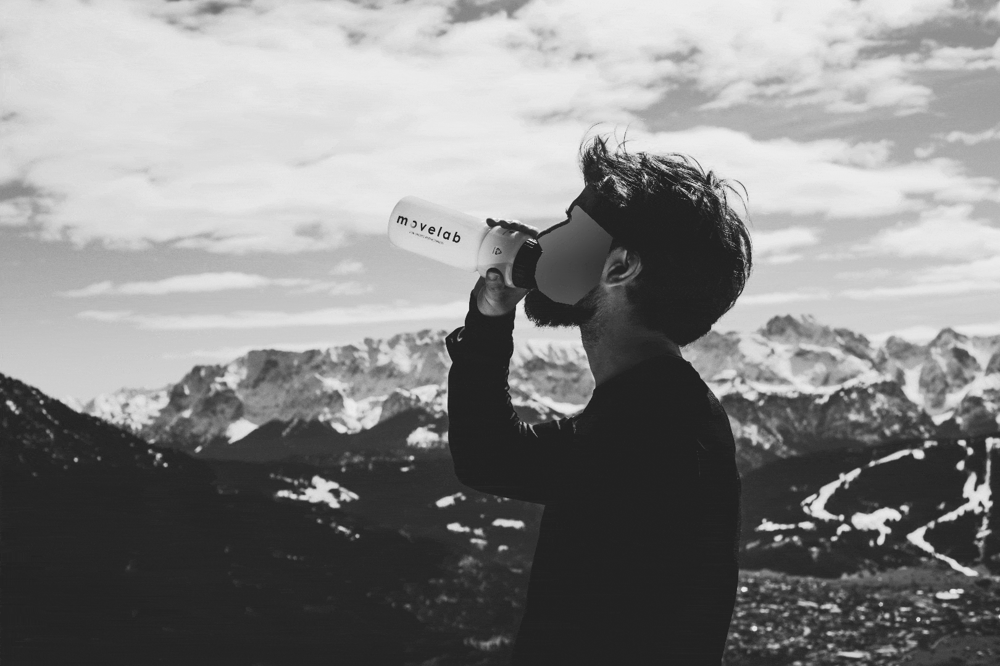
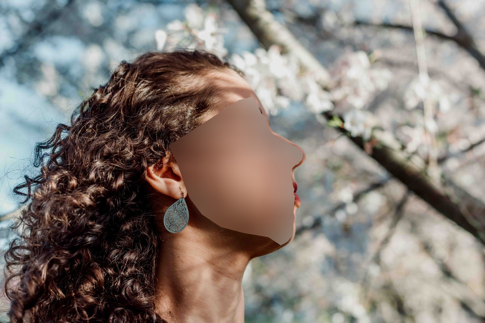
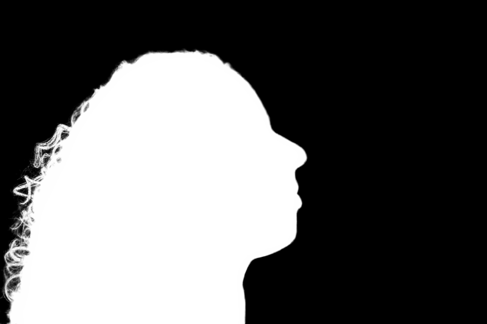
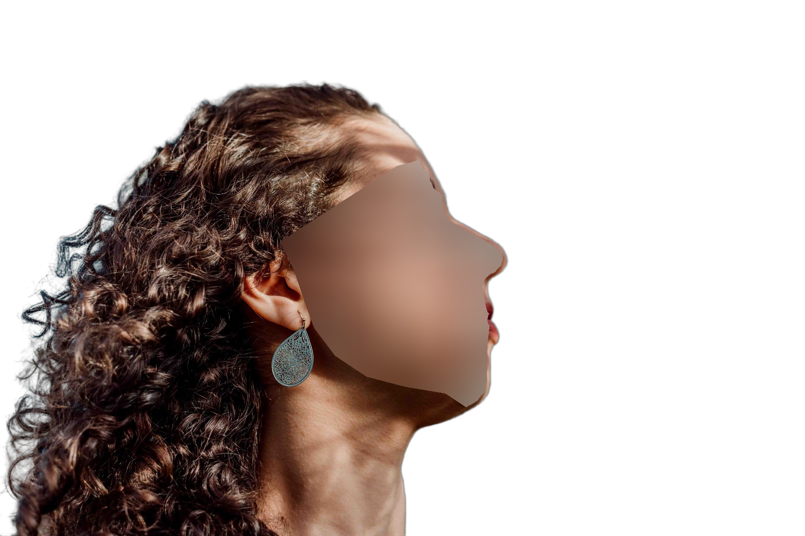
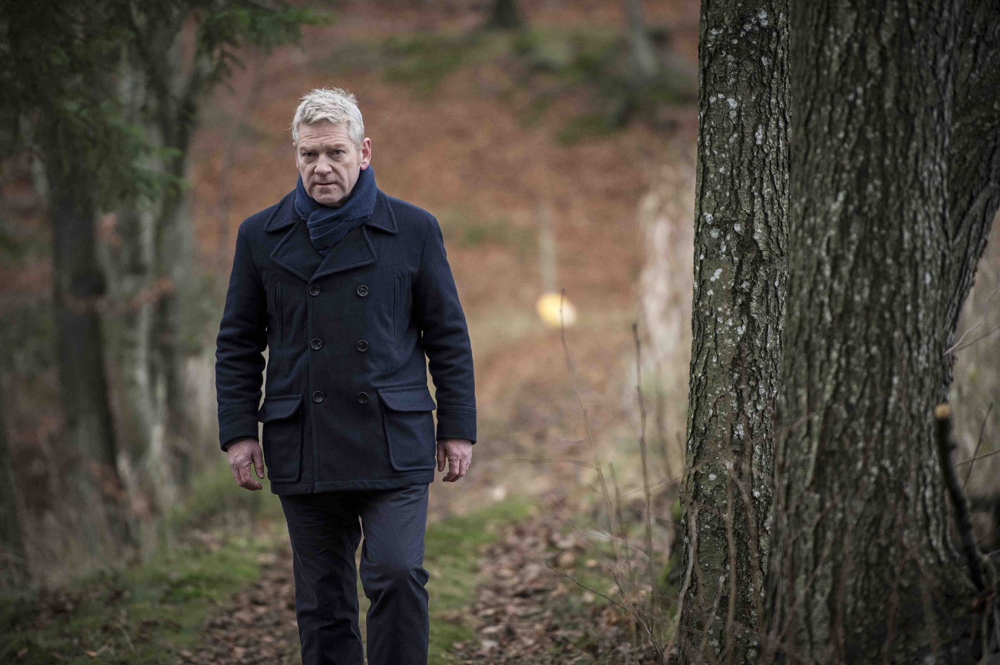
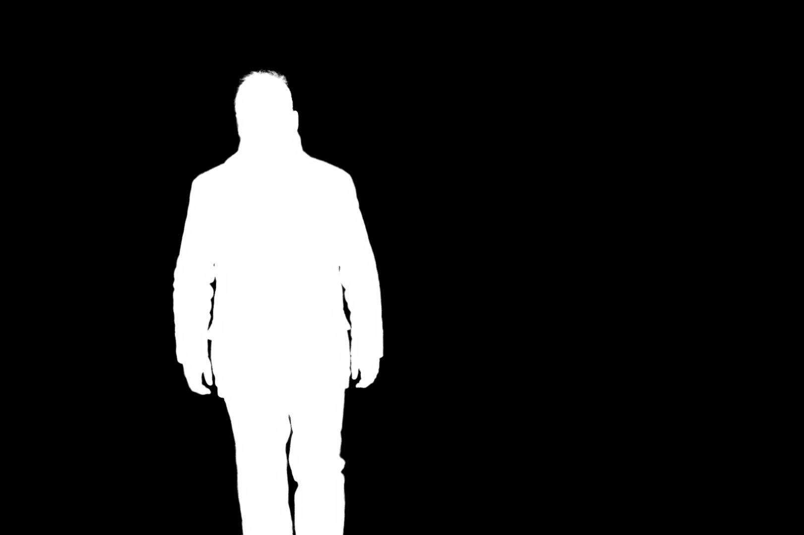
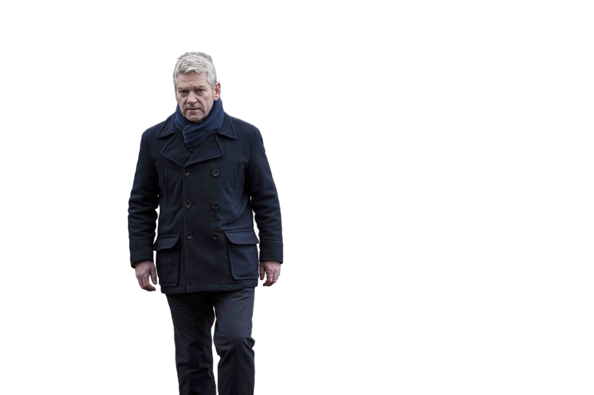
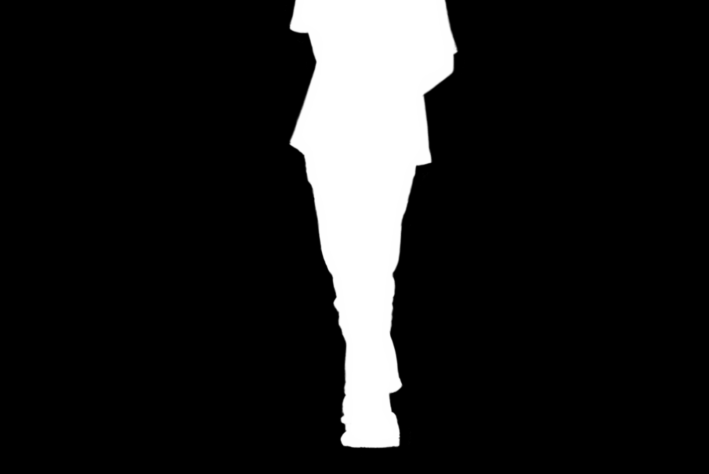
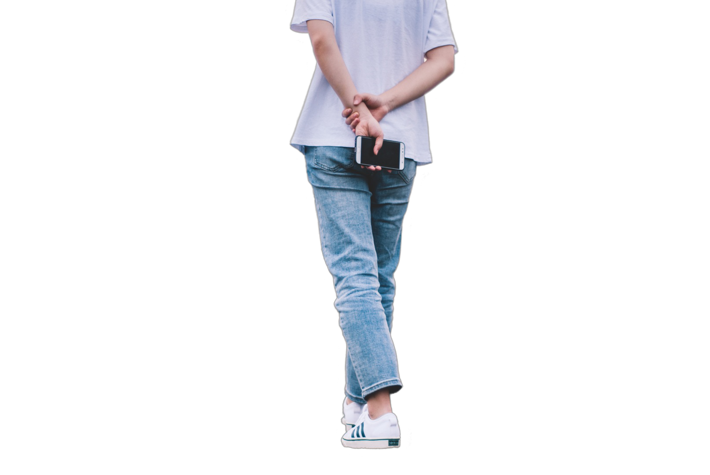

<h1 align="center">Privacy-Preserving Portrait Matting [ACM MM-21]</h1>

<p align="center">
<a href="https://arxiv.org/abs/2104.14222">.svg" ></a>
<a href=""></a>
<a href="https://dl.acm.org/doi/10.1145/3474085.3475512"></a>
<a href="https://paperswithcode.com/sota/image-matting-on-p3m-10k"></a>
</p>

<h4 align="center">This is the official repository of the paper <a href="https://arxiv.org/abs/2104.14222">Privacy-Preserving Portrait Matting</a>.</h4>


<h5 align="center"><em>Jizhizi Li<sup>&#8727;</sup>, Sihan Ma<sup>&#8727;</sup>, Jing Zhang, and Dacheng Tao</em></h5>

<p align="center">
  <a href="#introduction">Introduction</a> |
  <a href="#ppt-setting-and-p3m-10k-dataset">PPT and P3M-10k</a> |
  <a href="#p3m-net">P3M-Net</a> |
  <a href="#benchmark">Benchmark</a> |
  <a href="#results">Results</a> |
  <a href="https://github.com/JizhiziLi/P3M/tree/master/core">Train and Test</a> |
  <a href="#inference-code---how-to-test-on-your-images">Inference code</a> |
  <a href="#statement">Statement</a>
</p>



***
><h3><strong><i>:postbox: News</i></strong></h3>
>
> [2022-03-31]: Publish the extended version paper "Rethinking Portrait Matting with Privacy Preserving". The code, dataset, and models are available at [Github](https://github.com/ViTAE-Transformer/ViTAE-Transformer-Matting).
>
> [2021-11-21]: Publish the dataset [<strong>P3M-10k</strong>](#ppt-setting-and-p3m-10k-dataset) (the <strong>largest</strong> privacy-preserving portrait matting dataset, contains <strong>10421</strong> high-resolution real-world face-blurred portrait images and the manually labeled alpha mattes.), the train code and the test code. The dataset P3M-10k can be accessed from the following link, please make sure that you have read and agreed to the agreement. The train code and test code can be viewed from this [code-base page](https://github.com/JizhiziLi/P3M/tree/master/core). 
> 
> [2021-12-06]: Publish the face mask of the training set and P3M-500-P validation set of [<strong>P3M-10k</strong>](#ppt-setting-and-p3m-10k-dataset) dataset.
> 
> | Dataset | <p>Dataset Link<br>(Google Drive)</p> | <p>Dataset Link<br>(Baidu Wangpan 百度网盘)</p> | Dataset Release Agreement|
>| :----:| :----: | :----: | :----: | 
>|P3M-10k|[Link](https://drive.google.com/uc?export=download&id=1LqUU7BZeiq8I3i5KxApdOJ2haXm-cEv1)|[Link](https://pan.baidu.com/s/1X9OdopT41lK0pKWyj0qSEA) (pw: fgmc)|[Agreement (MIT License)](https://jizhizili.github.io/files/p3m_dataset_agreement/P3M-10k_Dataset_Release_Agreement.pdf)|
>|P3M-10k facemask (optional)|[Link](https://drive.google.com/file/d/1I-71PbkWcivBv3ly60V0zvtYRd3ddyYs/view?usp=sharing)|[Link](https://pan.baidu.com/s/1D9Kj_OIJbFTsqWfbMPzh_g) (pw: f772)|[Agreement (MIT License)](https://jizhizili.github.io/files/p3m_dataset_agreement/P3M-10k_Dataset_Release_Agreement.pdf)| 
>
> [2021-11-20]: Publish the <a href="#inference-code---how-to-test-on-your-images">inference code</a> and the pretrained model ([Google Drive](https://drive.google.com/uc?export=download&id=1smX2YQGIpzKbfwDYHAwete00a_YMwoG1) | [Baidu Wangpan (pw: 2308)](https://pan.baidu.com/s/1zGF3qnnD8qpI-Z5Nz0TDGA)) that can be used to test on your own privacy-preserving or normal portrait images. Some test results on P3M-10k can be viewed from this [demo page](https://github.com/JizhiziLi/P3M/tree/master/demo).


## Introduction


<p align="justify">Recently, there has been an increasing concern about the privacy issue raised by using personally identifiable information in machine learning. However, previous portrait matting methods were all based on identifiable portrait images.</p>

<p align="justify">To fill the gap, we present <a href="#ppt-setting-and-p3m-10k-dataset"><strong>P3M-10k</strong></a> in this paper, which is the first large-scale anonymized benchmark for Privacy-Preserving Portrait Matting. <strong>P3M-10k</strong> consists of 10,000 high-resolution face-blurred portrait images along with high-quality alpha mattes. We systematically evaluate both trimap-free and trimap-based matting methods on P3M-10k and find that existing matting methods show different generalization capabilities when following the Privacy-Preserving Training (PPT) setting, 𝑖.𝑒., <i>training on face-blurred images and testing on arbitrary images</i>.</p>

<p align="justify">To devise a better trimap-free portrait matting model, we propose <a href="#p3m-net"><strong>P3M-Net</strong></a>, which leverages the power of a unified framework for both semantic perception and detail matting, and specifically emphasizes the interaction between them and the encoder to facilitate the matting process. Extensive experiments on P3M-10k demonstrate that P3M-Net outperforms the state-of-the-art methods in terms of both objective metrics and subjective visual quality. Besides, it shows good generalization capacity under the PPT setting, confirming the value of P3M-10k for facilitating future research and enabling potential real-world applications.</p>


## PPT Setting and P3M-10k Dataset


<p align="justify"><strong>PPT Setting</strong>: Due to the privacy concern, we propose the <strong>P</strong>rivacy-<strong>P</strong>reserving <strong>T</strong>raining (<strong>PPT</strong>) setting in portrait matting, 𝑖.𝑒., training on privacy-preserved images (𝑒.𝑔., processed by face obfuscation) and testing on arbitraty images with or without privacy content. As an initial step towards privacy-preserving portrait matting problem, we only define the <i>identifiable faces</i> in frontal and some profile portrait images as the private content in this work. </p>


<p align="justify"><strong>P3M-10k Dataset</strong>: To further explore the effect of PPT setting, we establish the first large-scale privacy-preserving portrait matting benchmark named P3M-10k. It contains 10,000 annonymized high-resolution portrait images by face obfuscation along with high-quality ground truth alpha mattes. Specifically, we carefully collect, filter, and annotate about <strong>10,000</strong> high-resolution images from the Internet with free use license. There are <strong>9,421</strong> images in the training set and <strong>500</strong> images in the test set, denoted as <strong><i>P3M-500-P</i></strong>. In addition, we also collect and annotate another <strong>500</strong> public celebrity images from the Internet without face obfuscation, to evaluate the performance of matting models under the PPT setting on normal portrait images, denoted as <strong><i>P3M-500-NP</i></strong>. We show some examples as below, where (a) is from the training set, (b) is from <strong><i>P3M-500-P</i></strong>, and (c) is from <strong><i>P3M-500-NP</i></strong>.</p>


P3M-10k and the facemask are now <strong>published</strong>!! You can get access to it from the following links, please make sure that you have read and agreed to the agreement. Note that the facemask is not used in our work. So it's optional to download it.

| Dataset | <p>Dataset Link<br>(Google Drive)</p> | <p>Dataset Link<br>(Baidu Wangpan 百度网盘)</p> | Dataset Release Agreement|
| :----:| :----: | :----: | :----: | 
|<strong>P3M-10k</strong>|[Link](https://drive.google.com/uc?export=download&id=1LqUU7BZeiq8I3i5KxApdOJ2haXm-cEv1)|[Link](https://pan.baidu.com/s/1X9OdopT41lK0pKWyj0qSEA) (pw: fgmc)|[Agreement (MIT License)](https://jizhizili.github.io/files/p3m_dataset_agreement/P3M-10k_Dataset_Release_Agreement.pdf)| 
|<strong>P3M-10k facemask</strong> (optional)|[Link](https://drive.google.com/file/d/1I-71PbkWcivBv3ly60V0zvtYRd3ddyYs/view?usp=sharing)|[Link](https://pan.baidu.com/s/1D9Kj_OIJbFTsqWfbMPzh_g) (pw: f772)|[Agreement (MIT License)](https://jizhizili.github.io/files/p3m_dataset_agreement/P3M-10k_Dataset_Release_Agreement.pdf)| 


## P3M-Net


Our proposed P3M-Net consists of four parts

- <strong>A Multi-task Framework</strong>:  To enable benefits from explicitly modeling both semantic segmentation and detail matting tasks and jointly optimizing for trimap-free matting, we follow [1] and [2], adopt a multi-task framework based on a modified version of ResNet-34, the model pretrained on ImageNet will be listed as follows;

- <strong>TFI: Tripartite-Feature Integration</strong>: TFI module is used in each matting decoder block to model the interaction between encoder, segmentation decoder, and the matting decoder. TFI has three inputs, the feature map of the previous matting decoder block, the feature map from the same level semantic decoder block, and the feature map from the symmetrical encoder block. TFI passes them through a projection layer, concats the outputs and feeds into a convolutional block to generate the output feature;

- <strong>sBFI: Shallow Bipartite-Feature Integration</strong>: sBFI module is used to model the interaction between the encoder and matting decoder. sBFI adopts the feature map from the first encoder block as a guidance to refine the output feature map from previous matting decoder block since shallow layers in the encoder contain many details and local structural information;

- <strong>dBFI: Deep Bipartite-Feature Integration</strong>: dBFI module is used to model the interaction between the encoder and segmentation decoder. dBFI adopts the feature map from the last encoder block as a guidance for the semantic decoder since it contains abundant global semantics. Specifically, dBFI fuses the feature map from the last encoder with the ones from semantic decoder to improve the feature representation ability for the high-level semantic segmentation task.

Here we provide the model we pretrained on P3M-10k and the backbone we pretrained on ImageNet.

| Model|  Pretrained Backbone on ImageNet | Pretrained P3M-NET on P3M-10k | 
| :----: | :----:| :----: | 
| Google Drive  | <a href="https://drive.google.com/uc?export=download&id=18Pt-klsbkiyonMdGi6dytExQEjzBnHwY">Link</a>| [Link](https://drive.google.com/uc?export=download&id=1smX2YQGIpzKbfwDYHAwete00a_YMwoG1) |
| <p>Baidu Wangpan<br>(百度网盘)</p> | <p><a href="https://pan.baidu.com/s/1vdMQwtu8lnhtLRPjYFG8rA">Link</a><br>(pw: 2v1t)</p>| <p><a href="https://pan.baidu.com/s/1zGF3qnnD8qpI-Z5Nz0TDGA">Link</a><br>(pw: 2308)</p>|


## Benchmark

A systematic evaluation of the existing trimap-based and trimap-free matting methods on P3M-10k is conducted to investigate the impact of the privacy-preserving training (PPT) setting on different matting models and gain some useful insights. Part of the results are shown as below. Please refer to the paper for full tables.

In the following tables, "B" denotes the blurred images, and "N" denotes the normal images. "B:N" denotes training on blurred images while testing on normal images, vice versa.

<table>
<caption>Table 1. Results of trimap-based deep learning methods on P3M-500-P.</caption>
    <thead>
        <tr>
            <th>Setting</th>
            <th colspan=2>B:B</th>
            <th colspan=2>B:N</th>
            <th colspan=2>N:B</th>
            <th colspan=2>N:N</th>
        </tr>
    </thead>
    <tbody>
        <tr>
            <th>Method</th>
            <th>SAD</th>
            <th>MSE</th>
            <th>SAD</th>
            <th>MSE</th>
            <th>SAD</th>
            <th>MSE</th>
            <th>SAD</th>
            <th>MSE</th>
        </tr>
        <tr>
            <td><a href="https://arxiv.org/abs/1703.03872">DIM</a></td>
            <td>4.8906</td>
            <td>0.0115</td>
            <td>4.8940</td>
            <td>0.0116</td>
            <td>4.8050</td>
            <td>0.0116</td>
            <td>4.7941</td>
            <td>0.0116</td>
        </tr>
        <tr>
            <td><a href="https://arxiv.org/abs/1807.10088">AlphaGAN</a></td>
            <td>5.2669</td>
            <td>0.0112</td>
            <td>5.2367</td>
            <td>0.0112</td>
            <td>5.7060</td>
            <td>0.0120</td>
            <td>5.6696</td>
            <td>0.0119</td>
        </tr>
        <tr>
            <td><a href="https://arxiv.org/pdf/2001.04069.pdf">GCA</a></td>
            <td>4.3593</td>
            <td>0.0088</td>
            <td>4.3469</td>
            <td>0.0089</td>
            <td>4.4068</td>
            <td>0.0089</td>
            <td>4.4002</td>
            <td>0.0089</td>
        </tr>
        <tr>
            <td><a href="https://arxiv.org/abs/1908.00672">IndexNet</a></td>
            <td>5.1959</td>
            <td>0.0156</td>
            <td>5.2188</td>
            <td>0.0158</td>
            <td>5.8267</td>
            <td>0.0202</td>
            <td>5.8509</td>
            <td>0.0204</td>
        </tr>
        <tr>
            <td><a href="https://arxiv.org/abs/2003.07711">FBA</a></td>
            <td>4.1330</td>
            <td>0.0088</td>
            <td>4.1267</td>
            <td>0.0088</td>
            <td>4.1666</td>
            <td>0.0086</td>
            <td>4.1544</td>
            <td>0.0086</td>
        </tr>
    </tbody>
</table>

<table>
<caption>Table 2. Results of trimap-free methods on P3M-500-P.</caption>
    <thead>
        <tr>
            <th>Setting</th>
            <th colspan=2>B:B</th>
            <th colspan=2>B:N</th>
            <th colspan=2>N:B</th>
            <th colspan=2>N:N</th>
        </tr>
    </thead>
    <tbody>
        <tr>
            <th>Method</th>
            <th>SAD</th>
            <th>MSE</th>
            <th>SAD</th>
            <th>MSE</th>
            <th>SAD</th>
            <th>MSE</th>
            <th>SAD</th>
            <th>MSE</th>
        </tr>
        <tr>
            <td><a href="https://arxiv.org/abs/1809.01354">SHM</a></td>
            <td>21.56</td>
            <td>0.0100</td>
            <td>24.33</td>
            <td>0.0116</td>
            <td>23.91</td>
            <td>0.0115</td>
            <td>17.13</td>
            <td>0.0075</td>
        </tr>
        <tr>
            <td><a href="https://openaccess.thecvf.com/content_CVPR_2019/papers/Zhang_A_Late_Fusion_CNN_for_Digital_Matting_CVPR_2019_paper.pdf">LF</a></td>
            <td>42.95</td>
            <td>0.0191</td>
            <td>30.84</td>
            <td>0.0129</td>
            <td>41.01</td>
            <td>0.0174</td>
            <td>31.22</td>
            <td>0.0123</td>
        </tr>
        <tr>
            <td><a href="https://openaccess.thecvf.com/content_CVPR_2020/papers/Qiao_Attention-Guided_Hierarchical_Structure_Aggregation_for_Image_Matting_CVPR_2020_paper.pdf">HATT</a></td>
            <td>25.99</td>
            <td>0.0054</td>
            <td>26.5</td>
            <td>0.0055</td>
            <td>35.02</td>
            <td>0.0103</td>
            <td>22.93</td>
            <td>0.0040</td>
        </tr>
        <tr>
            <td><a href="https://arxiv.org/abs/2010.16188">GFM</a></td>
            <td>13.20</td>
            <td>0.0050</td>
            <td>13.08</td>
            <td>0.0050</td>
            <td>13.54</td>
            <td>0.0048</td>
            <td>10.73</td>
            <td>0.0033</td>
        </tr>
        <tr>
            <td>BASIC</td>
            <td>15.13</td>
            <td>0.0058</td>
            <td>15.52</td>
            <td>0.0060</td>
            <td>24.38</td>
            <td>0.0109</td>
            <td>14.52</td>
            <td>0.0054</td>
        </tr>
        <tr>
            <td>P3M-Net (Ours)</td>
            <td><strong>8.73</strong></td>
            <td><strong>0.0026</strong></td>
            <td><strong>9.22</strong></td>
            <td><strong>0.0028</strong></td>
            <td><strong>11.22</strong></td>
            <td><strong>0.0040</strong></td>
            <td><strong>9.06</strong></td>
            <td><strong>0.0028</strong></td>
        </tr>
    </tbody>
</table>

## Results

We test our network on our proposed P3M-500-P and P3M-500-NP and compare with previous SOTA methods, we list the results as below. More results on P3M-10k test set can be found [here](https://github.com/JizhiziLi/P3M/tree/master/demo/).


## Inference Code - How to Test on Your Images

Here we provide the procedure of testing on sample images by our pretrained model:

1. Setup environment following this [instruction page](https://github.com/JizhiziLi/P3M/tree/master/core);

2. Insert the path `REPOSITORY_ROOT_PATH` in the file `core/config.py`;

3. Download the pretrained P3M-Net model from here ([Google Drive](https://drive.google.com/uc?export=download&id=1smX2YQGIpzKbfwDYHAwete00a_YMwoG1)|[Baidu Wangpan (pw: 2308)](https://pan.baidu.com/s/1zGF3qnnD8qpI-Z5Nz0TDGA)) and unzip to the folder `models/pretrained/`;

4. Save your sample images in folder `samples/original/.`;
    
5. Setup parameters in the file `scripts/test_samples.sh` and run by:

    `chmod +x scripts/test_samples.sh`

    `scripts/test_samples.sh`;

6. The results of alpha matte and transparent color image will be saved in folder `samples/result_alpha/.` and `samples/result_color/.`.

We show some sample images, the predicted alpha mattes, and their transparent results as below. We use the pretrained model from section <a href="#p3m-net">Network</a> with `Hybrid (1 & 1/2)` test strategy.






## Statement

If you are interested in our work, please consider citing the following:

```
@inproceedings{10.1145/3474085.3475512,
author = {Li, Jizhizi and Ma, Sihan and Zhang, Jing and Tao, Dacheng},
title = {Privacy-Preserving Portrait Matting},
year = {2021},
isbn = {9781450386517},
publisher = {Association for Computing Machinery},
address = {New York, NY, USA},
url = {https://doi.org/10.1145/3474085.3475512},
doi = {10.1145/3474085.3475512},
booktitle = {Proceedings of the 29th ACM International Conference on Multimedia},
pages = {3501–3509},
numpages = {9},
keywords = {trimap, benchmark, portrait matting, deep learning, semantic segmentation, privacy-preserving},
location = {Virtual Event, China},
series = {MM '21}
}
```

This project is under MIT licence.

For further questions, please contact <strong><i>Jizhizi Li</i></strong> at [jili8515@uni.sydney.edu.au](mailto:jili8515@uni.sydney.edu.au) or <strong><i>Sihan Ma</i></strong> at sima7436@uni.sydney.edu.au.


## Relevant Projects

[1] <strong>Rethinking Portrait Matting with Pirvacy Preserving, arXiv, 2022</strong> | [Paper](https://arxiv.org/abs/2203.16828) | [Github](https://github.com/ViTAE-Transformer/ViTAE-Transformer-Matting)
<br><em>&ensp; &ensp; &ensp;Sihan Ma<sup>&#8727;</sup>, Jizhizi Li<sup>&#8727;</sup>, Jing Zhang, He Zhang, and Dacheng Tao</em>

[2] <strong>Bridging Composite and Real: Towards End-to-end Deep Image Matting, IJCV, 2022 </strong> | [Paper](https://link.springer.com/article/10.1007/s11263-021-01541-0) | [Github](https://github.com/JizhiziLi/GFM)
<br><em>&ensp; &ensp; &ensp;Jizhizi Li<sup>&#8727;</sup>, Jing Zhang<sup>&#8727;</sup>, Stephen J. Maybank, Dacheng Tao</em>

[3] <strong>Deep Automatic Natural Image Matting, IJCAI, 2021</strong> | [Paper](https://www.ijcai.org/proceedings/2021/0111) | [Github](https://github.com/JizhiziLi/AIM)
<br><em>&ensp; &ensp; &ensp;Jizhizi Li, Jing Zhang, and Dacheng Tao</em>
