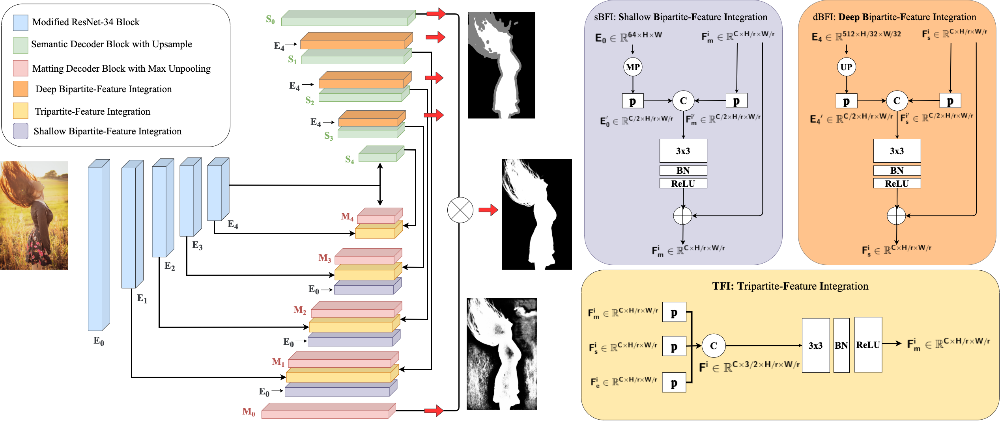

<h1 align="center">Privacy-Preserving Portrait Matting [ACMMM-21]</h1>

<!-- <p align="center"> -->
<!-- <a href="https://arxiv.org/abs/2104.14222">.svg" ></a> -->
<!-- <a href=""></a> -->
<!-- <a href=""></a> -->
<!-- </p> -->


<h4 align="center">This is the official repository of the paper <a href="https://arxiv.org/abs/2104.14222">Privacy-Preserving Portrait Matting</a>.</h4>

<p align="center">
  <a href="#introduction">Introduction</a> |
  <a href="#ppt-setting-and-p3m-10k-dataset">PPT and P3M-10k</a> |
  <a href="#p3m-net">P3M-Net</a> |
  <a href="#results">Results</a> |
  <a href="#statement">Statement</a>
</p>

***
><h3><strong><i>:postbox: News</i></strong></h3>
> The training code, the inference code, the pretrained models and the P3M dataset will be released soon. Please stay tuned to this repo for any further updates.
> 

## Introduction


<p align="justify">Recently, there has been an increasing concern about the privacy issue raised by using personally identifiable information in machine learning. However, previous portrait matting methods were all based on identifiable portrait images.</p>

<p align="justify">To fill the gap, we present <a href="#ppt-setting-and-p3m-10k-dataset"><strong>P3M-10k</strong></a> in this paper, which is the first large-scale anonymized benchmark for Privacy-Preserving Portrait Matting. <strong>P3M-10k</strong> consists of 10,000 high-resolution face-blurred portrait images along with high-quality alpha mattes. We systematically evaluate both trimap-free and trimap-based matting methods on P3M-10k and find that existing matting methods show different generalization capabilities when following the Privacy-Preserving Training (PPT) setting, 𝑖.𝑒., <i>training on face-blurred images and testing on arbitrary images</i>.</p>

<p align="justify">To devise a better trimap-free portrait matting model, we propose <a href="#p3m-net"><strong>P3M-Net</strong></a>, which leverages the power of a unified framework for both semantic perception and detail matting, and specifically emphasizes the interaction between them and the encoder to facilitate the matting process. Extensive experiments on P3M-10k demonstrate that P3M-Net outperforms the state-of-the-art methods in terms of both objective metrics and subjective visual quality. Besides, it shows good generalization capacity under the PPT setting, confirming the value of P3M-10k for facilitating future research and enabling potential real-world applications.</p>


## PPT Setting and P3M-10k Dataset


<p align="justify"><strong>PPT Setting</strong>: Due to the privacy concern, we propose the <strong>P</strong>rivacy-<strong>P</strong>reserving <strong>T</strong>raining (<strong>PPT</strong>) setting in portrait matting, 𝑖.𝑒., training on privacy-preserved images (𝑒.𝑔., processed by face obfuscation) and testing on arbitraty images with or without privacy content. As an initial step towards privacy-preserving portrait matting problem, we only define the <i>identifiable faces</i> in frontal and some profile portrait images as the private content in this work. </p>


<p align="justify"><strong>P3M-10k Dataset</strong>: To further explore the effect of PPT setting, we establish the first large-scale privacy-preserving portrait matting benchmark named P3M-10k. It contains 10,000 annonymized high-resolution portrait images by face obfuscation along with high-quality ground truth alpha mattes. Specifically, we carefully collect, filter, and annotate about <strong>10,000</strong> high-resolution images from the Internet with free use license. There are <strong>9,421</strong> images in the training set and <strong>500</strong> images in the test set, denoted as <strong><i>P3M-500-P</i></strong>. In addition, we also collect and annotate another <strong>500</strong> public celebrity images from the Internet without face obfuscation, to evaluate the performance of matting models under the PPT setting on normal portrait images, denoted as <strong><i>P3M-500-NP</i></strong>. We show some examples as below. We will publish the whole dataset soon.</p>

<!-- Show some p3m10k traing/ p3m-500-p / p3m-500-np examples here -->
<!--  -->

<!-- Should we display the benchmark results of trimap-free and trimap-based methods on P3M-10k here?? -->


## P3M-Net




Our proposed P3M-Net consists of four parts

- <strong>A Multi-task Framework</strong>:  To enable benefits from explicitly modeling both semantic segmentation and detail matting tasks and jointly optimizing for trimap-free matting, we follow [1] and [2], adopt a multi-task framework based on a modified version of ResNet-34, the model pretrained on ImageNet will be listed as follows;

- <strong>TFI: Tripartite-Feature Integration</strong>: TFI module is used in each matting decoder block to model the interaction between encoder, segmentation decoder, and the matting decoder. TFI has three inputs, the feature map of the previous matting decoder block, the feature map from the same level semantic decoder block, and the feature map from the symmetrical encoder block. TFI passes them through a projection layer, concats the outputs and feeds into a convolutional block to generate the output feature;

- <strong>sBFI: Shallow Bipartite-Feature Integration</strong>: sBFI module is used to model the interaction between the encoder and matting decoder. sBFI adopts the feature map from the first encoder block as a guidance to refine the output feature map from previous matting decoder block since shallow layers in the encoder contain many details and local structural information.

- <strong>dBFI: Deep Bipartite-Feature Integration</strong>: dBFI module is used to model the interaction between the encoder and segmentation decoder. dBFI adopts the feature map from the last encoder block as a guidance for the semantic decoder since it contains abundant global semantics. Specifically, dBFI fuses the feature map from the last encoder with the ones from semantic decoder to improve the feature representation ability for the high-level semantic segmentation task.


| Pretrained Backbone on ImageNet | Pretrained P3M-NET on P3M-10k | 
| :----:| :----: | 
|coming soon|coming soon| 


## Results

We test our network on our proposed P3M-500-P and P3M-500-NP and compare with previous SOTA methods, we list the results as below.


## Statement

If you are interested in our work, please consider citing the following:


```
@inproceedings{acmmm2021-p3m,
  title     = {Privacy-Preserving Portrait Matting},
  author    = {Li, Jizhizi and Ma, Sihan and Zhang, Jing and Tao, Dacheng},
  booktitle = {Proceedings of the 29th ACM international conference on Multimedia},
  year      = {2021}
}
```

This project is for academic use only. For further questions, please contact [jili8515@uni.sydney.edu.au](mailto:jili8515@uni.sydney.edu.au).


## Relevant Projects

[1] <strong>End-to-end Animal Image Matting, arxiv, 2020</strong> | [Paper](https://arxiv.org/pdf/2010.16188v1.pdf) | [Github](https://github.com/JizhiziLi/animal-matting)
<br><em>Jizhizi Li, Jing Zhang, Stephen J. Maybank, Dacheng Tao</em>

[2] <strong>Deep Automatic Natural Image Matting, IJCAI, 2021</strong> | [Paper](https://www.ijcai.org/proceedings/2021/0111.pdf) | [Github](https://github.com/JizhiziLi/AIM)
<br><em>&ensp; &ensp; &ensp;Jizhizi Li, Jing Zhang, and Dacheng Tao</em>
